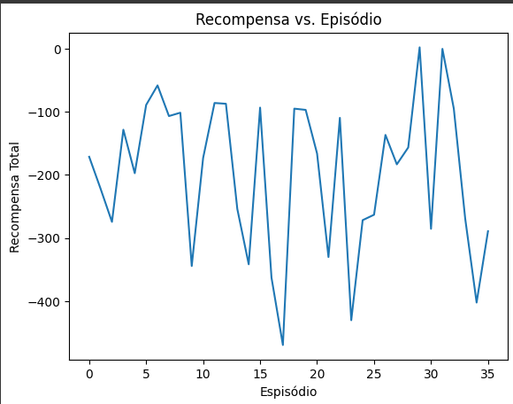

# LunaLander

## Porque Deep Q-Network?

Para elaboração desse trabalho tentei implementar o Q-Learning utilizando uma tabela de estado e ação, entretanto, o estado do luna lander são muito grandes, já que dentro de um estado contém 8 observações, podendo gerar muitas combinações, então utilizei o Deep Q-Network, pois consegue lidar com grande quantidade de estados.

## Elaboração

Para a atividade foi elaborado uma classe DQN onde irá realizar todas as etapas do algoritmo, nela contém os seguintes métodos:

* act: O agente toma uma ação baseada no estado atual
* updateEpsilon: Atualiza o epsilon pelo Epsilon-Greedy
* saveExperience: Salva a experiência do DQN, já que é utilizado para aprendizado com um limite de experiências salvas
* train: Treina o agente de acordo com as experiências
  
## Resultados

Neste gráfico percebe-se que os hiperparâmetros devem ser ajustados, pois as recompensas estão variando muito, ele atinge um patamar bom e logo em seguida cai, algums das melhoras pode ser rodar mais episódios para ver se o modelo irá continuar esse comportamento ou irá maximizar a recompensa, lembrando que o gráfico mostra o total de recompensa por episódio. O intuito de fazer alterações é fazer com que a recompensa esteja sempre no patamar mais alto.

Os seguintes hiperparâmetros foram utilizados para a elaboração do primeiro teste:
* learning_rate = 0.001
* gamma = 0.99
* epsilon = 1.0
* epsilon_decay = 0.005
* max_step = 1000
* batch_size = 32
* total_steps = 0
* episodes = 50

Neste teste 1 não podemos considerar como uma boa solução, pois a recompensa não chegou nem a 200, todas as recompensas são negativas.

